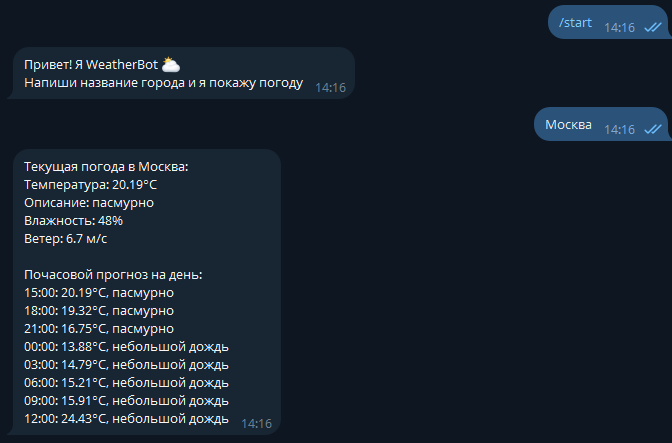
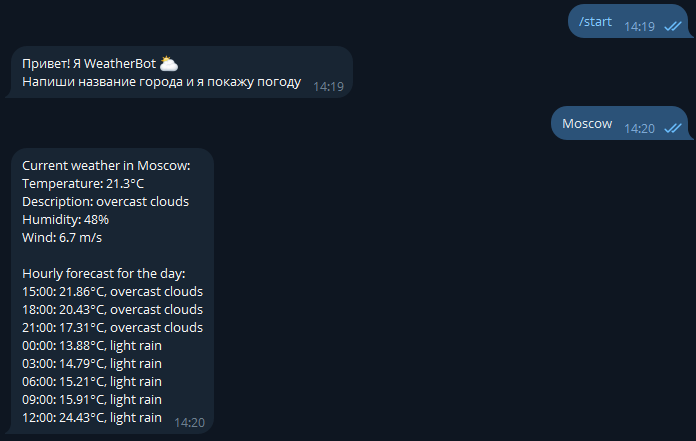

# telegram-weather-bot
Telegram-бот, который показывает прогноз погоды в любом городе. Поддерживает русский и английский языки.

## Демострация
**Русский язык:**

**English:**

## Технологии
- Python
- telebot

## Установка и запуск
1. Клонируй репозиторий
2. Установи зависимости `pip install -r requirements.txt`
3. Подключить ключ Telegram (@BotFather)
4. Полключить ключ Weather (openweathermap.org)
5. Запуск VPN (если заблокирован Telegram)
6. Запуск `weather_bot.py`

